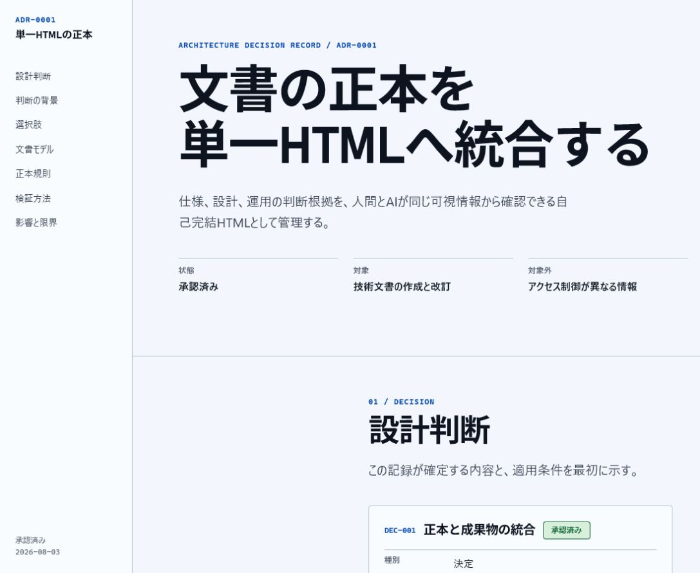

<p align="right"><a href="./README.md">日本語</a> | <strong>English</strong></p>

# Comprehensible Documents

A Codex Skill for creating, revising, and auditing technical documents that humans and AI can read directly from the same canonical HTML file.



## The problem this Skill solves

Technical documents do not become difficult to understand only when information is missing.
When the same decision is copied into an overview, body text, diagram, and AI summary, readers must infer which version is authoritative and maintainers must update every copy.

Comprehensible Documents treats this burden as **understanding debt**.
Instead of deleting information to make a document look shorter, it organizes the canonical statements, status, rationale, exceptions, and next actions into one self-contained HTML file.

| Problem | How this Skill handles it |
|---|---|
| Requirements or decisions are paraphrased in several places | Each canonical statement appears once; other sections refer to its stable ID. |
| Human documentation and AI summaries are separate | Humans and AI read the same visible body text. |
| Meaning exists only in color, diagrams, or layout | Headings, prose, tables, and alternative text also carry the meaning. |
| Confirmed and unresolved information are mixed together | Type, status, normative strength, and scope are visible. |
| Reading depends on the original conversation or authoring Skill | A cold-read audit uses the finished HTML alone. |

## Three forms of singularity

The design centers on three forms of singularity.

1. **One source of truth:** Do not duplicate the same requirement, decision, or constraint as new prose.
2. **One artifact:** Produce one self-contained HTML file for one purpose by default.
3. **One audience:** Do not create separate human and AI derivatives; both use the same visible evidence.

Length alone is not a reason to split a document.
A document contract, headings, navigation, stable IDs, and progressive disclosure create predictable paths to the required information.

The [evidence map](./references/evidence-map.html) connects design rules to research findings and their limits.
It does not turn cognitive research into fixed item counts, universal colors, or unsupported comprehension scores.

## A real output example

[ADR: Use a single HTML file as the source of truth](./examples/ADR-0001-SINGLE-HTML-SOURCE-OF-TRUTH.html) is a finished artifact created with this Skill's workflow and document system.
It contains its CSS, diagram, and canonical records in one HTML file and requires no JavaScript, external fonts, or external images.

| Desktop | Mobile | Mobile index |
|---|---|---|
|  |  |  |

Download the HTML file and open it in a browser to inspect its content and layout without a network connection.

## Supported documents

The structure is selected from the decision or task the reader must complete, not from the document's label alone.

| Document type | Reader task | Primary canonical units |
|---|---|---|
| Requirements | Decide what must be satisfied for approval | Requirements, constraints, acceptance criteria |
| High-level design | Understand boundaries and major structures | Design decisions, boundaries, major flows |
| Detailed design | Verify implementable contracts and exceptions | Interfaces, data, states |
| ADR | Trace an adopted decision and its rationale | One decision |
| Runbook | Reach the same operational result safely | Preconditions, actions, expected results, stop conditions |
| Operations and security | Decide responsibilities, access, monitoring, and recovery | Controls, responsibility boundaries, detection, response |
| API and reference | Find values and contracts quickly | Definitions, signatures, fields, constraints |
| Research and analysis | Evaluate whether evidence supports a conclusion | Questions, observations, inferences, conclusions |
| Education and explanation | Understand a concept and transfer it to another problem | Conceptual models, worked examples, exercises |

Do not use this Skill for ordinary HTML reading, simple summarization or translation, web application UI design, or work that must remain in DOCX, PDF, slide, or spreadsheet formats.

## Installation

Codex loads repository-scoped skills from `.agents/skills` and user-scoped skills from `$HOME/.agents/skills`.
The following commands install this Skill for the current user.

### Windows PowerShell

- Working directory: `$HOME\.agents\skills`
- Skill file created: `comprehensible-documents\SKILL.md`
- Prerequisites: Git and Python 3 available as commands

```powershell
New-Item -ItemType Directory -Force -Path "$HOME\.agents\skills" | Out-Null
Set-Location "$HOME\.agents\skills"
git clone <repository-url> comprehensible-documents
python .\comprehensible-documents\scripts\validate_skill_bundle.py .\comprehensible-documents
```

Replace `<repository-url>` with the URL copied from GitHub's **Code** menu.
The validation output should end with `ERROR 0`.

```text
BUNDLE ...\comprehensible-documents
ERROR 0
```

### macOS / Linux

- Working directory: `$HOME/.agents/skills`
- Skill file created: `comprehensible-documents/SKILL.md`
- Prerequisites: Git and Python 3 available as commands

```bash
mkdir -p "$HOME/.agents/skills"
cd "$HOME/.agents/skills"
git clone <repository-url> comprehensible-documents
python3 ./comprehensible-documents/scripts/validate_skill_bundle.py ./comprehensible-documents
```

Replace `<repository-url>` with the URL copied from GitHub's **Code** menu.
The validation output should end with `ERROR 0`.

```text
BUNDLE .../comprehensible-documents
ERROR 0
```

Codex detects the Skill automatically.
Restart Codex if it does not appear.

See OpenAI's [Build skills](https://learn.chatgpt.com/docs/build-skills) for the official skill locations and explicit and implicit invocation behavior.

## Usage

In Codex, mention the Skill explicitly in the prompt.

```text
Use $comprehensible-documents to turn these requirement notes into a self-contained HTML requirements document.
```

Codex can also select the Skill implicitly when the request matches its description.
Use an explicit mention when the output format and audit scope must be unambiguous.

### Create a document

```text
Use $comprehensible-documents to create an incident recovery runbook.
Include canonical preconditions, stop conditions, expected results for every step, failure branches, and rollback instructions.
```

### Revise an existing HTML document

```text
Use $comprehensible-documents to revise @HLD.html.
Preserve existing canonical IDs and the file name, and update only the affected decisions and their references.
```

### Audit understanding debt

```text
Use $comprehensible-documents to audit @REQUIREMENTS.html for canonical integrity and understanding debt.
Audit only; do not change the file.
```

## Workflow

1. Validate the Skill bundle before starting document work.
2. Establish the purpose, readers, scope, source of truth, status, and unresolved items as the document contract.
3. Select the document type and sections from the order in which readers decide or act.
4. Assign stable IDs where needed to requirements, decisions, constraints, assumptions, prohibitions, recommendations, and open items.
5. Assemble one self-contained HTML file using the template and document tokens.
6. Run a cold-read audit with the HTML alone and then run the machine audit.
7. When layout is in scope, render the final artifact at affected viewport sizes and inspect it visually.

The machine audit checks syntax and mechanically testable structure.
It does not assign a comprehension score or guarantee correct human or AI judgment, so the cold-read audit remains separate.

## Audit a generated HTML document

- Working directory: the directory containing the HTML document
- Target file: `<DOCUMENT-NAME>.html`
- Script: `<skill-directory>/scripts/audit_document.py`

```text
python <skill-directory>/scripts/audit_document.py <DOCUMENT-NAME>.html
```

The expected result is `ERROR 0`.
Review every warning and decide whether it is an intentional exception or a defect.

```text
AUDIT <DOCUMENT-NAME>.html
ERROR 0 / WARNING 0
```

## Repository layout

```text
comprehensible-documents/
├── SKILL.md                       # Trigger boundary and workflow
├── agents/openai.yaml             # Codex UI metadata and invocation policy
├── assets/document-system/        # HTML template and design tokens
├── examples/                      # Finished artifacts created with the Skill
├── references/                    # Design rules, document types, evidence, quality gates
└── scripts/                       # Bundle validation, HTML audit, regression tests
```

Primary design references:

- [Single-document model](./references/single-document-model.html)
- [Shared human-AI document model](./references/human-ai-document-model.html)
- [Document genre matrix](./references/document-genre-matrix.html)
- [Hallmark document profile](./references/hallmark-document-profile.html)
- [Document quality gates](./references/quality-gates.html)
- [Evidence map](./references/evidence-map.html)
- [Document file naming policy](./references/naming-policy.html)

## Development validation

- Working directory: the repository root
- Targets: the complete Skill bundle and `scripts/test_*.py`

```text
python scripts/validate_skill_bundle.py .
python -m unittest discover -s scripts -p "test_*.py" -v
```

The bundle validation must end with `ERROR 0`, and all regression tests must end with `OK`.

## License

Licensed under the [MIT License](./LICENSE).
